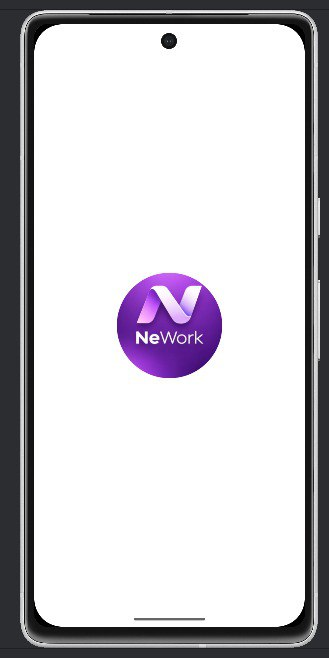
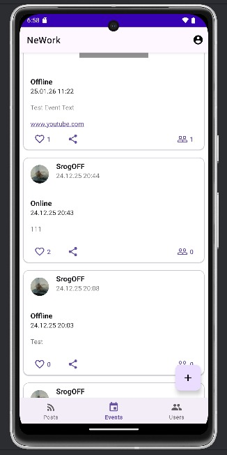
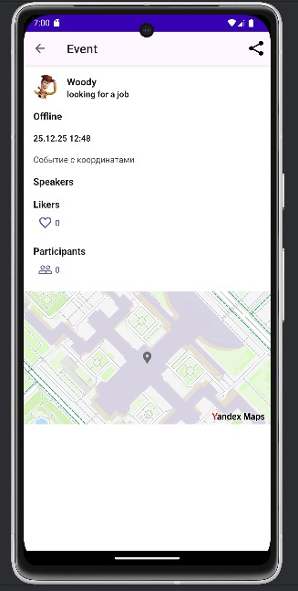

# NeWork — Социальная сеть для Android

Дипломный проект — мобильное Android-приложение, представляющее собой социальную сеть с публикацией
постов, событий и управлением профилем.

## 🚀 Функциональность

### Авторизация

- Вход по логину и паролю
- Регистрация с загрузкой аватара
- Сохранение сессии между запусками приложения
- Выход из аккаунта

### Посты

- Лента постов с загрузкой из сети
- Создание поста с текстом, вложением (фото / аудио / видео) и ссылкой
- Лайки и удаление собственных постов
- Детальный экран поста: упомянутые пользователи, место работы автора, карта

### События

- Лента событий (онлайн / офлайн)
- Создание события с выбором типа, даты проведения и вложений
- Участие в событиях
- Детальный экран: участники, спикеры, карта

### Пользователи

- Список всех пользователей
- Детальный экран: стена постов пользователя + список мест работы

### Профиль

- Просмотр собственной стены
- Управление местами работы: добавление и удаление

## 🛠 Технологии

- **Язык:** Kotlin
- **Архитектура:** Single Activity + Fragment, MVVM
- **DI:** Dagger Hilt
- **Сеть:** Retrofit 2 + OkHttp + Moshi
- **Асинхронность:** Kotlin Coroutines + LiveData
- **База данных:** Room (кэширование)
- **Пагинация:** Paging 3
- **Изображения:** Glide
- **Карты:** Яндекс Карты
- **Навигация:** Navigation Component
- **UI:** Material Design 3

## 📦 Основные зависимости

- Retrofit 2.9.0 — сетевые запросы
- Dagger Hilt 2.51.1 — внедрение зависимостей
- Room 2.6.1 — локальное хранилище
- Paging 3.2.1 — пагинация
- Glide 4.16.0 — загрузка изображений
- Yandex Maps 4.2.2 — отображение карт
- Navigation Component 2.7.7 — навигация
- ImagePicker 2.1 — выбор фото из галереи/камеры

## 📡 Сервер

Приложение работает с сервером: `http://94.228.125.136:8080/`

API задокументировано в Swagger.

### Требования

- Android Studio Iguana или новее
- JDK 17
- Android SDK API 34
- Устройство или эмулятор с Android 8.0 (API 26) и выше

## 📱 Скриншоты

|           Экран входа           |
|:-------------------------------:|
|  |

|        Список событий         |
|:-----------------------------:|
|  |

|                 Детали события                  |
|:-----------------------------------------------:|
|  |

